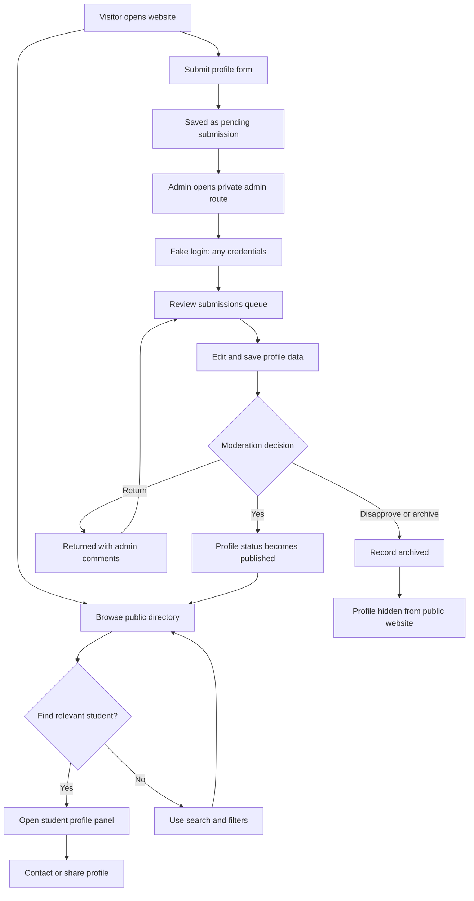
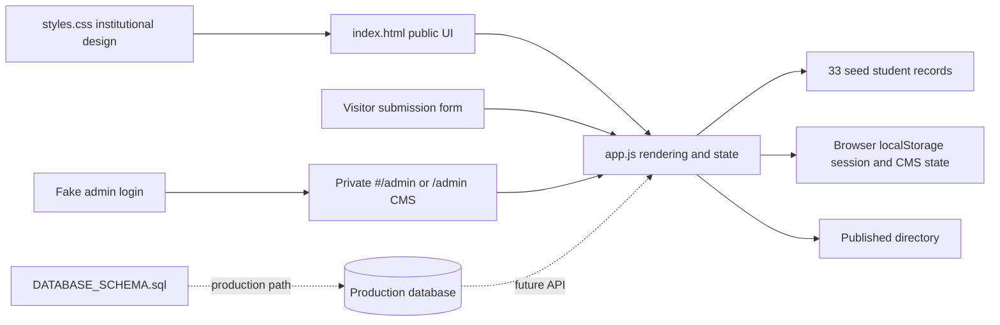

# OJT Defense README - Mapua Student Portfolio Registry

## Prototype Overview

The Mapua Student Portfolio Registry is a professional student portfolio directory prototype created for an OJT defense. It demonstrates how Mapua students can be discovered by year level, course type, availability, skills, and project evidence.

Created by Christine Julliane Reyes, 3rd Year BS Data Science Student.

## What The Prototype Covers

- Public student directory with 33 sample profiles.
- School/institutional UI using a red, gold, and white palette.
- Course categories for Computer Science, Information Technology, Information Systems, Data Science, Tech Courses, and Media and Design.
- Year-level statuses: 1st Year, 2nd Year, 3rd Year, 4th Year, and Fresh Grad with years since graduation.
- Visitor profile submission.
- Private admin CMS prototype with fake login, session persistence, profile add/edit/save, approval, return with comments, archive/disapprove, restore, and delete.
- SQL database schema for future production implementation.
- Responsive static website with no runtime dependencies.
- Chapter 3 alignment with the SOIT Student Portfolio Dashboard project overview, objectives, significance, scope, and limitations.

## User Flow Diagram



## System Architecture



## Running The App

Open `index.html` directly in a browser.

Optional local static server:

```powershell
npx serve .
```

Then open the printed local URL.

No API keys, backend services, package installation, or database server are required for the prototype.

## Admin Route

Local/static access:

```text
index.html#/admin
```

Hosted access when the server rewrites `/admin` to `index.html`:

```text
/admin
```

The fake login accepts any email and password. This is intentional for prototype demonstration only.

## Prototype Data Flow

1. Seed profiles are loaded from `app.js`.
2. Visitor submissions are saved to browser local storage with `pending` status.
3. Admin edits can clean, classify, and save profile records before publication.
4. Admin approval changes a submitted profile to `published`.
5. Admin can return a submission with comments, archive/disapprove records, restore archived records, delete records, or add new profiles.
6. Published records appear in the public directory immediately after state changes.

## Chapter 3 Traceability

| Chapter 3 Point | Prototype Evidence |
| --- | --- |
| Centralize student achievements, academic standing, and project history | Public directory and profile detail panel |
| Clean unstructured data into a relational model | Structured seed records and SQL schema |
| Frontend dashboard for academic administrators | Private admin CMS route |
| Real-time portfolio updates | Local storage state updates immediately refresh the directory |
| Reduce administrative friction | Search, filters, edit/save, approve, return, archive, restore |
| Scope limited to SOIT data | Course categories focus on IT, computing, data, tech, and media/design programs |
| External Mapua server syncing outside scope | No Blackboard or Mapua server integration is required |

## Database And CMS Plan

The current CMS is a browser-based prototype. The production design should use:

- `students` table for identity, academic status, publication status, and public profile fields.
- `student_skills` table for searchable skills.
- `student_projects` table for portfolio evidence.
- `student_metrics` table for measurable results.
- `admin_audit_logs` table for approval, return, edit, restore, and archive traceability.

See `.local/docs/DATABASE_SCHEMA.sql`.

## Defense Talking Points

- The prototype is not just a visual mockup; it has working filters, submission, fake admin login, profile editing, approval, return with comments, archive/restore, delete, and profile rendering.
- The UI is aligned to a school/institutional tone using red, gold, white, and formal typography.
- The product supports Mapua's technology and industry-facing positioning by making student work discoverable and evidence-based.
- The architecture separates content, presentation, and workflow state.
- The SQL schema shows how the static prototype can evolve into a real CMS-backed production system.
- Local storage is intentionally used only for prototype demonstration; production should use authentication, database persistence, validation, privacy controls, and audit logging.
- The project matches the Chapter 3 scope: no live Blackboard or external Mapua server sync is required for this 320-hour deployment.

## Files To Present

- `index.html` - page structure and sections.
- `styles.css` - institutional visual design and responsive layout.
- `app.js` - sample data, filters, details, submission, admin route, fake login, and CMS behavior.
- `.local/docs/PRD.md` - product requirements.
- `.local/docs/DATABASE_SCHEMA.sql` - database schema.
- `.local/docs/README.md` - defense guide, user flow, architecture, and run instructions.
