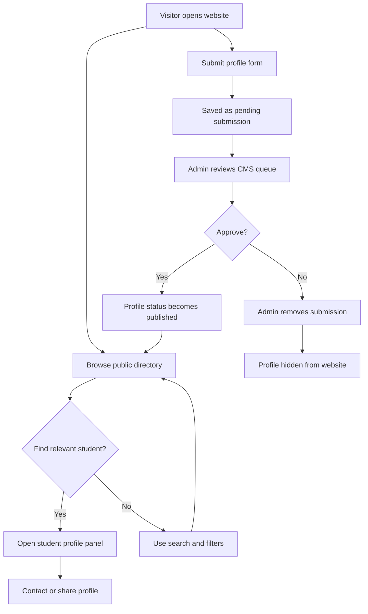
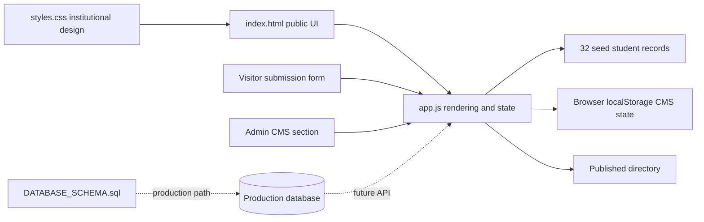

# OJT Defense README - Mapua Student Portfolio Registry

## Prototype Overview

The Mapua Student Portfolio Registry is a professional student portfolio directory prototype created for an OJT defense. It demonstrates how Mapua students can be discovered by year level, course type, availability, skills, and project evidence.

Created by Christine Julliane Reyes, 3rd Year BS Data Science Student.

## What The Prototype Covers

- Public student directory with 33 sample profiles.
- School/institutional UI using a red, gold, and white palette.
- Course categories for Computer Science, Information Technology, Information Systems, Data Science, Tech Courses, and Media and Design.
- Year-level statuses: 1st Year, 2nd Year, 3rd Year, 4th Year, and Fresh Grad with years since graduation.
- Visitor profile submission.
- Admin CMS prototype for approval and removal.
- SQL database schema for future production implementation.
- Responsive static website with no runtime dependencies.

## User Flow Diagram



## System Architecture



## Running The App

Open `index.html` directly in a browser.

Optional local static server:

```powershell
npx serve .
```

Then open the printed local URL.

No API keys, backend services, package installation, or database server are required for the prototype.

## Prototype Data Flow

1. Seed profiles are loaded from `app.js`.
2. Visitor submissions are saved to browser local storage with `pending` status.
3. Admin approval changes a submitted profile to `published`.
4. Published submissions appear in the public directory.
5. Admin removal hides published or pending records from the website.

## Database And CMS Plan

The current CMS is a browser-based prototype. The production design should use:

- `students` table for identity, academic status, publication status, and public profile fields.
- `student_skills` table for searchable skills.
- `student_projects` table for portfolio evidence.
- `student_metrics` table for measurable results.
- `admin_audit_logs` table for approval/removal traceability.

See `.local/docs/DATABASE_SCHEMA.sql`.

## Defense Talking Points

- The prototype is not just a visual mockup; it has working filters, submission, approval, removal, and profile rendering.
- The UI is aligned to a school/institutional tone using red, gold, white, and formal typography.
- The product supports Mapua's technology and industry-facing positioning by making student work discoverable and evidence-based.
- The architecture separates content, presentation, and workflow state.
- The SQL schema shows how the static prototype can evolve into a real CMS-backed production system.
- Local storage is intentionally used only for prototype demonstration; production should use authentication, database persistence, validation, and privacy controls.

## Files To Present

- `index.html` - page structure and sections.
- `styles.css` - institutional visual design and responsive layout.
- `app.js` - sample data, filters, details, submission, and CMS behavior.
- `.local/docs/PRD.md` - product requirements.
- `.local/docs/DATABASE_SCHEMA.sql` - database schema.
- `.local/docs/README.md` - defense guide, user flow, architecture, and run instructions.
